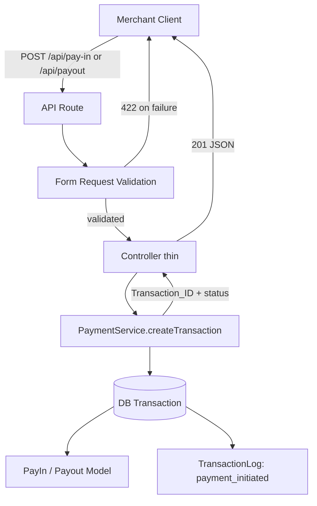
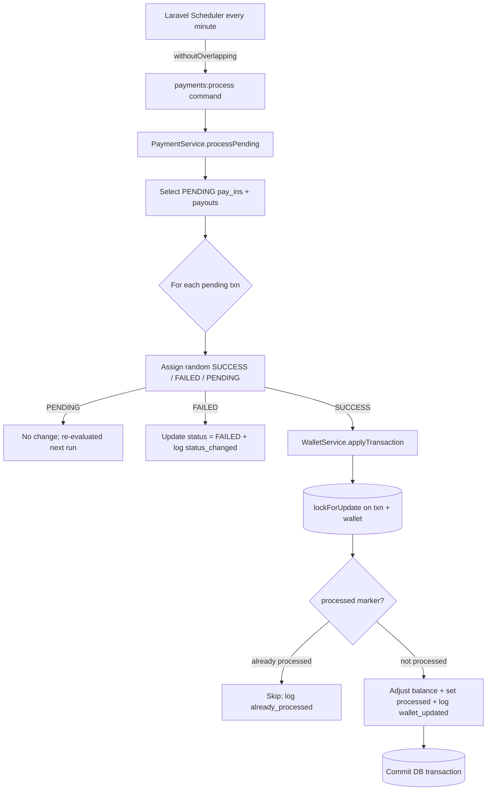

# Design Document

## Overview

The Pay-in & Payout Module is a backend payment-processing feature built on Laravel 13 (PHP ^8.3). It exposes two JSON API endpoints for merchants to initiate pay-in and payout transactions, persists each transaction in a `PENDING` state with a globally unique transaction identifier, and resolves transactions asynchronously through a scheduled Artisan console command. Successful transactions adjust the owning merchant's wallet balance exactly once, protected by row-level locking, an atomic database transaction, and an idempotency marker so that no balance is ever adjusted twice for the same transaction.

The design follows a strict layered architecture. Controllers are thin and delegate to service classes; validation lives in Form Request classes; data access uses Eloquent models with explicit relationships; scheduled processing runs through an Artisan command driven by the Laravel scheduler. Laravel Backpack provides CRUD administration for merchants, wallets, pay-ins, and payouts with status, merchant, and date-range filters.

This design addresses all ten requirements. The core financial logic (transaction creation, wallet adjustment, idempotency, status transitions) is well suited to property-based testing and is covered by correctness properties below. The admin CRUD, infrastructure wiring, and configuration concerns are covered by example-based and integration tests.

### Key Design Decisions

- **Separate `pay_ins` and `payouts` tables** (per Requirement 1.3) rather than a single polymorphic transaction table. This matches the requirement wording, keeps Backpack CRUD simple, and lets each table carry its own indexes. A shared `TransactionLog` uses a `transaction_type` + `transaction_id` pair to reference either table.
- **Money stored as `decimal(14,2)`** — a total precision of 14 digits with 2 decimal places covers the required range `0.01 .. 999,999,999,999.99` (12 integer digits + 2 fractional). Money is handled as string/`BCMath`-safe decimals in PHP to avoid floating-point drift.
- **Idempotency via a `processed` marker plus row-level lock plus DB transaction** (Requirements 5.6, 6.1–6.5). Three mechanisms combine: `lockForUpdate()` serializes concurrent processing of the same row; the `processed` boolean prevents re-application after commit; the wrapping DB transaction guarantees the balance change and marker flip commit or roll back together.
- **Backpack not yet installed** — installation is a first task in implementation. The design specifies the CRUD controllers and configuration that will be created after `composer require backpack/crud` and `php artisan backpack:install`.
- **Database portability** — SQLite is the default connection and MySQL is configured. `lockForUpdate()` is a no-op under SQLite (which serializes writes anyway) but is honored under MySQL/InnoDB. The idempotency `processed` marker guarantees correctness independent of lock support, so the design is safe on both.

## Architecture

### Layered Request Flow



### Scheduled Processing Flow



### Component Responsibilities

| Layer | Component | Responsibility |
|-------|-----------|----------------|
| Routing | `routes/api.php` | Maps `POST /api/pay-in` and `POST /api/payout` to controllers |
| HTTP | `PayInController`, `PayoutController` | Thin: receive validated request, call `PaymentService`, return JSON (Req 7.1) |
| Validation | `StorePayInRequest`, `StorePayoutRequest` | Form Request rules run before any business logic (Req 7.3, 7.4) |
| Service | `PaymentService` | Transaction creation + scheduled processing logic (Req 7.1) |
| Service | `WalletService` | Wallet balance adjustment only, with atomicity + idempotency (Req 7.2, 5.x, 6.x) |
| Service | `TransactionLogger` | Writes `TransactionLog` rows and Laravel Log entries with masking (Req 9) |
| Console | `ProcessPaymentsCommand` (`payments:process`) | Artisan command invoked by scheduler (Req 7.6, 4.x) |
| Models | `Merchant`, `Wallet`, `PayIn`, `Payout`, `TransactionLog` | Eloquent + relationships (Req 7.5) |
| Admin | Backpack CRUD controllers | List/create/read/update/delete + filters (Req 8) |

## Components and Interfaces

### PaymentService

```php
namespace App\Services;

class PaymentService
{
    public function __construct(
        private WalletService $walletService,
        private TransactionLogger $logger,
    ) {}

    /**
     * Create a PAYIN or PAYOUT transaction in PENDING state.
     * Persists merchant ref, amount, status, transaction_id atomically (Req 2.3 / 3.3).
     * Logs payment_initiated (Req 2.8 / 3.8).
     *
     * @param 'payin'|'payout' $type
     * @return PayIn|Payout
     */
    public function createTransaction(string $type, int $merchantId, string $amount): Model;

    /**
     * Generate a Transaction_ID unique across all transactions (Req 2.2 / 3.2).
     */
    public function generateTransactionId(): string;

    /**
     * Select all PENDING transactions and resolve each with a random outcome (Req 4.3–4.8).
     * Delegates SUCCESS handling to WalletService.
     */
    public function processPending(): ProcessingSummary;

    /**
     * Assign one status at random from {success, failed, pending} (Req 4.5).
     */
    public function randomOutcome(): PaymentStatus;
}
```

### WalletService

```php
namespace App\Services;

class WalletService
{
    /**
     * Apply a SUCCESS transaction to the owning merchant's wallet exactly once.
     *
     * Wraps in DB::transaction:
     *   1. lockForUpdate() on the transaction row and the wallet row (Req 6.5).
     *   2. If transaction.processed == true -> skip, log already_processed, no balance change (Req 5.6, 6.2).
     *   3. PAYIN  -> balance += amount (Req 5.1).
     *      PAYOUT -> if balance >= amount: balance -= amount (Req 5.2)
     *                else: leave unchanged, log insufficient_balance rejection (Req 5.5).
     *   4. On a balance change: set processed = true, log wallet_updated in same txn (Req 5.3, 6.3).
     * If commit fails, both roll back (Req 5.3, 6.4).
     *
     * @return WalletAdjustmentResult (applied | skipped_already_processed | insufficient_balance | failed)
     */
    public function applyTransaction(PayIn|Payout $transaction): WalletAdjustmentResult;
}
```

### TransactionLogger

```php
namespace App\Services;

class TransactionLogger
{
    /**
     * Write a TransactionLog row AND a Laravel Log entry.
     * Sensitive request fields are masked before persistence/logging (Req 9.1).
     * Log severity INFO for events, ERROR for exceptions (Req 9.x), UTC timestamp.
     */
    public function log(
        string $transactionType,
        string $transactionId,
        string $eventType,   // payment_initiated | status_changed | wallet_updated | insufficient_balance | already_processed | processing_failed
        array $details,
        string $severity = 'info',
    ): TransactionLog;

    /** Masks fields such as email, api_key from a details array. */
    private function mask(array $details): array;
}
```

### Controllers (thin)

```php
class PayInController extends Controller
{
    public function store(StorePayInRequest $request, PaymentService $service): JsonResponse
    {
        $txn = $service->createTransaction('payin', $request->integer('merchant_id'), $request->string('amount'));
        return response()->json([
            'transaction_id' => $txn->transaction_id,
            'status'         => $txn->status,
        ], 201); // Req 2.4
    }
}
// PayoutController::store mirrors this for 'payout' (Req 3.4).
```

### API Endpoints

| Method | Path | Form Request | Success | Errors |
|--------|------|--------------|---------|--------|
| POST | `/api/pay-in` | `StorePayInRequest` | 201 `{transaction_id, status}` | 422 validation |
| POST | `/api/payout` | `StorePayoutRequest` | 201 `{transaction_id, status}` | 422 validation |

**Request body (both):**
```json
{ "merchant_id": 1, "amount": "150.00" }
```

**Success response (201):**
```json
{ "transaction_id": "TXN-PI-20240612-9F3A2B7C4D", "status": "pending" }
```

**Validation error response (422):**
```json
{
  "message": "The amount must be a number.",
  "errors": { "amount": ["The amount is invalid."] }
}
```

### Form Request Validation Rules

`StorePayInRequest` / `StorePayoutRequest` share the same rules, mapping directly to acceptance criteria:

```php
public function rules(): array
{
    return [
        // Req 2.5 / 3.5: merchant must exist -> 422 with "not recognized" message
        'merchant_id' => ['required', 'integer', 'exists:merchants,id'],

        // Req 2.6/2.7 / 3.6: numeric, > 0, <= max, at most 2 decimal places -> 422
        'amount' => [
            'required',
            'numeric',
            'gt:0',
            'max:999999999999.99',
            'decimal:0,2',           // at most 2 decimal places
        ],
    ];
}

public function messages(): array
{
    return [
        'merchant_id.exists'  => 'The merchant identifier is not recognized.',
        'amount.decimal'      => 'The amount is invalid; at most 2 decimal places are allowed.',
        'amount.numeric'      => 'The amount is invalid; it must be numeric.',
        'amount.gt'           => 'The amount is out of range; it must be greater than 0.',
        'amount.max'          => 'The amount is out of range; it exceeds the maximum allowed value.',
    ];
}
```

Because validation runs in the Form Request before the controller body executes, a failed validation returns 422 and never reaches `PaymentService`, so no transaction is created and no log entry is written (Req 7.4, 2.5–2.7, 3.5–3.6).

### Transaction ID Generation Strategy

Transaction IDs must be unique across **all** transactions (both tables), per Req 2.2 / 3.2. Strategy:

- Format: `TXN-<PI|PO>-<UTC date yyyymmdd>-<10 uppercase hex chars>` where the hex suffix is derived from `Str::random`/`random_bytes`. The type prefix guarantees pay-in and payout IDs never collide with each other by construction.
- A unique index on `pay_ins.transaction_id` and on `payouts.transaction_id` (Req 1.5) enforces uniqueness at the database level. Combined with the disjoint prefixes, no two transactions across both tables can share an ID.
- Generation retries on the rare event of a collision (catch unique-constraint violation, regenerate) inside the creation transaction.

## Data Models

### Entity Relationship

```mermaid
erDiagram
    MERCHANT ||--|| WALLET : "has one"
    MERCHANT ||--o{ PAY_IN : "initiates"
    MERCHANT ||--o{ PAYOUT : "initiates"
    PAY_IN ||--o{ TRANSACTION_LOG : "logged by"
    PAYOUT ||--o{ TRANSACTION_LOG : "logged by"

    MERCHANT {
        bigint id PK
        string name
        string email
        string api_key UK
        timestamps ts
    }
    WALLET {
        bigint id PK
        bigint merchant_id FK UK
        decimal balance
        string currency
        timestamps ts
    }
    PAY_IN {
        bigint id PK
        bigint merchant_id FK
        string transaction_id UK
        decimal amount
        string status
        boolean processed
        timestamps ts
    }
    PAYOUT {
        bigint id PK
        bigint merchant_id FK
        string transaction_id UK
        decimal amount
        string status
        boolean processed
        timestamps ts
    }
    TRANSACTION_LOG {
        bigint id PK
        string transaction_type
        string transaction_id
        string event_type
        json details
        timestamp created_at
    }
```

### Migration: `merchants` (Req 1.1)

| Column | Type | Constraints |
|--------|------|-------------|
| `id` | `bigIncrements` | PK |
| `name` | `string(255)` | not null |
| `email` | `string(255)` | not null |
| `api_key` | `string(255)` | **unique** |
| `created_at`, `updated_at` | `timestamps` | |

### Migration: `wallets` (Req 1.2, 1.7, 1.8, 1.9)

| Column | Type | Constraints |
|--------|------|-------------|
| `id` | `bigIncrements` | PK |
| `merchant_id` | `foreignId` | FK -> `merchants.id`, **unique** (enforces one-to-one, Req 1.7/1.8), cascade on delete |
| `balance` | `decimal(14,2)` | not null, **default `0.00`** (Req 1.9), range 0.00 .. 999,999,999,999.99 |
| `currency` | `string(3)` | not null, **default `'USD'`** (Req 1.9) |
| `created_at`, `updated_at` | `timestamps` | |

The unique index on `merchant_id` makes a second wallet insert for the same merchant fail at the DB level, leaving the existing wallet unchanged (Req 1.8).

### Migration: `pay_ins` and `payouts` (Req 1.3, 1.5, 1.6)

Identical structure for both tables:

| Column | Type | Constraints |
|--------|------|-------------|
| `id` | `bigIncrements` | PK |
| `merchant_id` | `foreignId` | FK -> `merchants.id`, **indexed** (Req 1.6) |
| `transaction_id` | `string(64)` | **unique index** (Req 1.5) |
| `amount` | `decimal(14,2)` | not null, range 0.01 .. 999,999,999,999.99 |
| `status` | `string(16)` | not null, default `'pending'`, restricted to {`pending`,`success`,`failed`}, **indexed** (Req 1.6) |
| `processed` | `boolean` | not null, default `false` (Processed_Marker, Req 6.1) |
| `created_at`, `updated_at` | `timestamps` | |

The status set {pending, success, failed} (Req 1.3) is enforced at the application layer via a PHP enum cast plus validation; on MySQL it may additionally be modeled as an `enum` column. SQLite lacks native enum/check enforcement, so the enum cast is the portable guarantee.

### Migration: `transaction_logs` (Req 1.4)

| Column | Type | Constraints |
|--------|------|-------------|
| `id` | `bigIncrements` | PK |
| `transaction_type` | `string(16)` | `payin` or `payout` |
| `transaction_id` | `string(64)` | references the transaction's business ID; indexed |
| `event_type` | `string(255)` | e.g. `payment_initiated`, `status_changed`, `wallet_updated` |
| `details` | `json` (text) | masked payload / event detail |
| `created_at` | `timestamp` | creation timestamp (UTC) |

### Eloquent Models (Req 7.5)

```php
// PaymentStatus enum
enum PaymentStatus: string {
    case Pending = 'pending';
    case Success = 'success';
    case Failed  = 'failed';
}

class Merchant extends Model {
    public function wallet(): HasOne { return $this->hasOne(Wallet::class); }
    public function payIns(): HasMany { return $this->hasMany(PayIn::class); }
    public function payouts(): HasMany { return $this->hasMany(Payout::class); }
}

class Wallet extends Model {
    protected $casts = ['balance' => 'decimal:2'];
    public function merchant(): BelongsTo { return $this->belongsTo(Merchant::class); }
}

class PayIn extends Model {
    protected $casts = ['amount' => 'decimal:2', 'processed' => 'boolean', 'status' => PaymentStatus::class];
    public function merchant(): BelongsTo { return $this->belongsTo(Merchant::class); }
    public function logs(): HasMany { /* where transaction_type = 'payin' */ }
}

class Payout extends Model {
    protected $casts = ['amount' => 'decimal:2', 'processed' => 'boolean', 'status' => PaymentStatus::class];
    public function merchant(): BelongsTo { return $this->belongsTo(Merchant::class); }
    public function logs(): HasMany { /* where transaction_type = 'payout' */ }
}

class TransactionLog extends Model {
    public $timestamps = false; // uses created_at only
    protected $casts = ['details' => 'array', 'created_at' => 'datetime'];
}
```

## Correctness Properties

*A property is a characteristic or behavior that should hold true across all valid executions of a system-essentially, a formal statement about what the system should do. Properties serve as the bridge between human-readable specifications and machine-verifiable correctness guarantees.*

The following properties cover the module's core financial and processing logic, which is pure enough (given a wallet/transaction state) to exercise with generated inputs. Schema structure, scheduler wiring, Backpack CRUD, and fault-injection cases are covered by unit/integration/smoke tests in the Testing Strategy instead.

### Property 1: Transaction IDs are globally unique

*For any* sequence of created pay-in and payout transactions, every generated `transaction_id` is distinct from every other across both the `pay_ins` and `payouts` tables.

**Validates: Requirements 1.5, 2.2, 3.2**

### Property 2: Valid input creates a fully-persisted PENDING transaction

*For any* existing merchant and any valid amount (numeric, `0 < amount <= 999,999,999,999.99`, at most 2 decimal places) and any transaction type in {payin, payout}, creating a transaction yields a persisted record whose type matches, whose status is `pending`, and whose `merchant_id`, `amount`, `status`, and `transaction_id` are all present (no partial record).

**Validates: Requirements 2.1, 2.3, 3.1, 3.3**

### Property 3: Successful creation returns 201 with the created identifiers

*For any* valid create request, the API responds with HTTP 201 and a body whose `transaction_id` and `status` equal those of the newly persisted transaction.

**Validates: Requirements 2.4, 3.4**

### Property 4: Unknown merchant is rejected with 422 and no side effects

*For any* `merchant_id` that does not reference an existing merchant, the API responds with HTTP 422 indicating the merchant is not recognized, and no transaction is created.

**Validates: Requirements 2.5, 3.5**

### Property 5: Invalid amounts are rejected with 422 and no side effects

*For any* amount that is missing, non-numeric, expressed with more than 2 decimal places, less than or equal to 0, or greater than `999,999,999,999.99`, the API responds with HTTP 422 and no transaction is created.

**Validates: Requirements 2.6, 2.7, 3.6**

### Property 6: The processor selects exactly the PENDING transactions

*For any* database state containing transactions of mixed statuses, a processing run selects precisely the set of transactions whose status is `pending` (so a transaction left `pending` is selected again on the next run).

**Validates: Requirements 4.3, 4.7**

### Property 7: Assigned outcomes are always within the allowed set

*For any* pending transaction evaluated by the processor, the assigned outcome is one of {`success`, `failed`, `pending`}.

**Validates: Requirements 4.5**

### Property 8: Status transitions persist and are logged with previous and new status

*For any* pending transaction assigned `success` or `failed`, the persisted status becomes exactly the assigned value and a `status_changed` log entry is recorded containing the transaction_id, the previous status, and the new status at INFO severity.

**Validates: Requirements 4.6, 4.8, 9.2**

### Property 9: Balance conservation on resolved transactions

*For any* wallet and any transaction resolved by the processor: if the transaction is a `success` pay-in the resulting balance equals the prior balance plus the amount; if it is a `success` payout with sufficient balance the resulting balance equals the prior balance minus the amount; if it is `failed` the balance is unchanged.

**Validates: Requirements 5.1, 5.2, 5.4**

### Property 10: Initiation is logged with sensitive fields masked

*For any* create request, a `payment_initiated` log entry is recorded referencing the transaction_id at INFO severity, and the stored details contain no raw value of a sensitive field (sensitive fields appear only in masked form).

**Validates: Requirements 2.8, 3.7, 9.1**

### Property 11: Insufficient-balance payout leaves the balance unchanged and logs a rejection

*For any* wallet whose balance is less than the amount of a `success` payout, the wallet balance is left unchanged and an insufficient-balance rejection is logged for that transaction_id.

**Validates: Requirements 5.5**

### Property 12: A transaction adjusts the wallet at most once (idempotency / no double deduction)

*For any* `success` transaction, applying it any number of times produces the same final balance as applying it exactly once, sets the `processed` marker to processed, and produces no additional `wallet_updated` log entries beyond the first application.

**Validates: Requirements 5.6, 6.2, 6.3, 6.5**

### Property 13: A wallet balance change and its wallet_updated log are atomic and paired

*For any* applied wallet adjustment, exactly one `wallet_updated` log entry exists for that transaction recording the transaction_id, adjustment amount, and resulting balance at INFO severity, and the recorded resulting balance equals the wallet's actual balance (the balance change and the log entry are committed together).

**Validates: Requirements 5.3, 9.3**

### Property 14: Failed validation produces no logs and no balance change

*For any* request that fails validation, no `TransactionLog` entry is written and no wallet balance changes.

**Validates: Requirements 7.3, 7.4**

## Error Handling

| Condition | Requirement | Handling |
|-----------|-------------|----------|
| Invalid request (bad amount / unknown merchant) | 2.5–2.7, 3.5–3.6, 7.3–7.4 | Form Request short-circuits with HTTP 422 and a field-level error map; no service code runs, no logs, no balance change |
| Transaction_ID collision on insert | 2.2, 3.2 | Catch unique-constraint violation inside the creation transaction, regenerate the ID, and retry (bounded retries) |
| Second wallet for a merchant | 1.8 | Unique index on `wallets.merchant_id` raises `QueryException`; existing wallet unchanged |
| Payout with insufficient balance | 5.5 | `WalletService` leaves balance unchanged and writes an `insufficient_balance` log; transaction remains `success` but wallet not debited |
| Already-processed transaction re-applied | 5.6, 6.2 | `processed` marker checked under lock; skip balance change, log `already_processed`, no extra `wallet_updated` |
| Persist/commit failure during status change or balance update | 4.9, 6.4, 9.4 | Wrapping `DB::transaction` rolls back both the balance change and marker (or the status change); previous persisted state retained; a `processing_failed` log is written and a Laravel Log entry at ERROR severity records the transaction_id and exception message |
| Uncaught exception during a processing run | 9.4 | Each transaction is processed inside its own try/catch + transaction so one failure does not abort the whole run; the failing transaction stays in its pre-exception state |
| Unauthenticated admin access | 8.9 | Backpack auth middleware denies access to CRUD routes |

**Atomicity guarantee.** All balance mutations run inside `DB::transaction(function () { ... })`. Within the closure the transaction row and wallet row are read with `lockForUpdate()`, the `processed` marker is checked, the balance is adjusted, the marker is set, and the `wallet_updated` log is written — all committing together or rolling back together (Req 5.3, 6.3, 6.4). Under SQLite, writer serialization plus the `processed` marker provide the same single-application guarantee that `lockForUpdate()` provides under MySQL/InnoDB.

**Sensitive-field masking.** `TransactionLogger::mask()` replaces values of configured sensitive keys (e.g. `email`, `api_key`) with a masked token before the details are persisted or written to the Laravel log (Req 9.1).

## Testing Strategy

### Dual Approach

- **Property-based tests** verify the 14 universal properties above across many generated inputs (wallets, amounts, transaction sets, statuses). These cover the core financial and processing logic.
- **Unit / integration / smoke tests** cover schema structure, scheduler wiring, Backpack CRUD, fault-injection error paths, and documentation/seeder checks that are not expressible as universal properties.

### Property-Based Testing

- **Library:** Property-based testing is applicable to this feature's financial logic. Use a PHP property-based testing library compatible with PHPUnit (for example, `innmind/black-box` or `giorgiosironi/eris`). Do **not** hand-roll a generator framework.
- **Iterations:** Each property test runs a minimum of **100 generated iterations**.
- **Generators:** Custom generators produce valid amounts (`decimal(14,2)` in range with ≤2 dp), invalid amounts (negative, zero, over-max, >2 dp, non-numeric strings), wallets with random starting balances, and mixed-status transaction sets. The DB is refreshed (`RefreshDatabase`) per case; AWS-free, in-memory SQLite keeps iterations cheap.
- **Tagging:** Each property test carries a comment referencing its design property in the format:
  `// Feature: pay-in-payout-module, Property {number}: {property_text}`
- **Mapping:** One property-based test per correctness property (Properties 1–14).

### Unit Tests (examples, edge cases, error conditions)

- Wallet default currency/balance on creation (Req 1.9).
- Empty pending set leaves all transactions unchanged (Req 4.4, EDGE_CASE).
- Persist-failure during status change retains previous status and logs a failure — via mocked persistence throwing (Req 4.9, EXAMPLE).
- Commit failure leaves balance and `processed` marker unchanged — via injected transaction failure (Req 6.4, EXAMPLE).
- Exception during processing writes an ERROR log and leaves persisted state intact (Req 9.4, EXAMPLE).
- Date-range filter boundary inclusivity (Req 8.7, EDGE_CASE).
- Seeder creates ≥3 merchants each with exactly one wallet and non-negative balance (Req 10.4).
- Model relationships resolve correctly (Req 7.5).

### Integration Tests

- Migrations create expected tables, columns, unique/regular indexes (Req 1.1–1.6, SMOKE).
- Scheduler registers `payments:process` at a fixed interval with `withoutOverlapping` (Req 4.1, 4.2, 7.6).
- Overlapping-run skip behavior (Req 4.2).
- Backpack CRUD list/create/read/update/delete for Merchant, Wallet, Pay-in, Payout (Req 8.1–8.4).
- Backpack status, merchant, and empty-result filters (Req 8.5, 8.6, 8.8).
- Unauthenticated access is denied to admin routes (Req 8.9).
- Concurrency: parallel processing attempts on the same transaction under MySQL result in exactly one balance change (Req 6.5, complements Property 12).

### Documentation Checks

- README documents environment, migration, and seeding steps with exact commands and expected outcomes (Req 10.1).
- API docs include sample requests, success responses, and error responses for each documented error (Req 10.2, 10.3).

### Why property-based testing applies here

The wallet arithmetic, idempotency, status transitions, validation, and ID uniqueness are pure input/output behaviors with universal invariants (balance conservation, no double deduction, membership of outcomes, uniqueness) that benefit from wide input coverage. The excluded areas — schema/migration structure, scheduler registration, Backpack-provided CRUD and auth, and fault-injection error paths — either have no meaningful input variation or test framework/infrastructure behavior, so example-based and integration tests are the right tools there.
